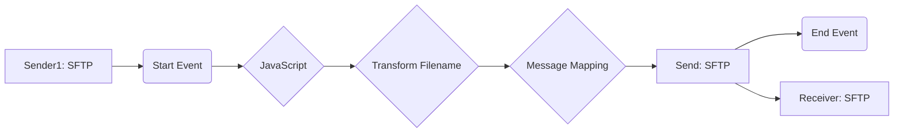

**iFlowId**: Connectivity_test_UK2_SFTP_copy - **iFlowVersion**: 1.0.1

**Mermaid Diagram**

**Functional Summary**
- **Brief description of the iFlow**
This iFlow retrieves a file from an SFTP server, transforms the filename, performs a message mapping, and sends the file to another SFTP server.

- **Involved systems with Adapters Type and Endpoint Type**
    - Sender1: SFTP Adapter (Endpoint Sender)
    - Receiver: SFTP Adapter (Endpoint Receiver)

- **Key steps**
 1. Receives a file named `test.txt` from the source SFTP server `/PRUEBA_POC` triggered by a scheduler.
 2. Executes a JavaScript script.
 3. Transforms the filename using a Groovy script named `transformFilename.groovy`.
 4. Performs a message mapping using Message Mapping.
 5. Sends the file to the target SFTP server to the `/UK2int/rpt/aviacao/in/AVR` path.

- **Message transformation**
    - Transform Filename: Groovy Script (`transformFilename.groovy`)
    - Message Mapping: Message Mapping

- **Externalized parameters list and their descriptions**
    - `host`: Hostname of the target SFTP server.
    - `user_uk2`: Username for the target SFTP server.

- **DataStore / JMS Dependency**
Not Found

- **Cloud Connector Dependency**
Yes

- **Common Scripts Dependency**
List of scripts: transformFilename.groovy

- **ProcessDirect ComponentType Dependency**
Not Found