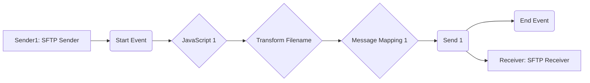

**iFlowId**: Connectivity_test_UK2_SFTP_copy - **iFlowVersion**: 1.0.1

**Mermaid Diagram**

**Functional Summary**
- **Brief description of the iFlow**
This iFlow retrieves a file from an SFTP server, transforms the filename, maps the message and then sends the file to another SFTP server.

- **Involved systems with Adapters Type and Endpoint Type**
    - Sender1: SFTP Adapter, Endpoint Sender
    - Receiver: SFTP Adapter, Endpoint Receiver

- **Key steps**
    1.  Receive file from SFTP server (Sender1). The SFTP sender polls the directory `/PRUEBA_POC` on host `b2b-test.repsol.com:122` every 10 seconds between 0:00 and 24:00.
    2.  Execute JavaScript.
    3.  Transform the filename using a Groovy script named `transformFilename.groovy`.
    4.  Map the message using Message Mapping.
    5.  Send the file to another SFTP server (Receiver). The SFTP receiver places the file in the directory `/UK2int/rpt/aviacao/in/AVR` on the host defined by the externalized parameter `{{host}}`.

- **Message transformation**
    - Transform Filename using Groovy Script `transformFilename.groovy`
    - Message Mapping using Message Mapping component

- **Externalized parameters list and their descriptions**
    - `{{host}}`: Hostname for the target SFTP server (Receiver).
    - `{{user_uk2}}`: Username for the target SFTP server (Receiver).

- **DataStore / JMS Dependency**
Not Found

- **Cloud Connector Dependency**
Yes

- **Common Scripts Dependency**
List of scripts: transformFilename.groovy

- **ProcessDirect ComponentType Dependency**
Not Found