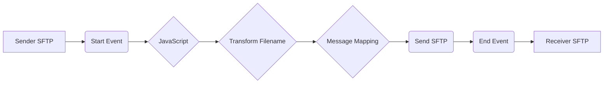

**iFlowId**: Connectivity_test_UK2_SFTP_copy - **iFlowVersion**: 1.0.1

**Mermaid Diagram**

**Functional Summary**
- **Brief description of the iFlow**
This iFlow picks up a file from a source SFTP server, transforms the filename, performs a message mapping, and then sends the file to a destination SFTP server.

- **Involved systems with Adapters Type and Endpoint Type**
    - Sender: SFTP Adapter, EndpointSender
    - Receiver: SFTP Adapter, EndpointRecevier

- **Key steps**
1. The iFlow starts with a file pickup from the source SFTP server based on a schedule.
2. A JavaScript step is executed
3. A Groovy script called `transformFilename.groovy` is used to transform the filename.
4. Message Mapping is performed (but no specific mapping is defined)
5. The file is sent to the destination SFTP server.

- **Message transformation**
    - Filename transformation using Groovy script `transformFilename.groovy`.
    - Message mapping step is included but no message mapping artifact is defined.

- **Externalized parameters list and their descriptions**
    - `{{host}}`: Hostname of the destination SFTP server.
    - `{{user_uk2}}`: Username for the destination SFTP server.

- **DataStore / JMS Dependency**
Not Found

- **Cloud Connector Dependency**
Yes

- **Common Scripts Dependency**
List of scripts: transformFilename.groovy

- **ProcessDirect ComponentType Dependency**
Not Found