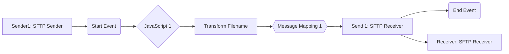

**iFlowId**: Connectivity_test_UK2_SFTP_copy - **iFlowVersion**: 1.0.1

**Mermaid Diagram**

**Functional Summary**
- **Brief description of the iFlow**
This iFlow retrieves a file from an SFTP server, transforms its filename, applies a message mapping and sends the file to another SFTP server.

- **Involved systems with Adapters Type and Endpoint Type**
    - Sender1: SFTP Adapter, EndpointSender
    - Receiver: SFTP Adapter, EndpointRecevier

- **Key steps**
    1.  Receive file from SFTP server (Sender1).
    2.  Execute a JavaScript.
    3.  Transform the filename using a Groovy script ("transformFilename.groovy").
    4.  Perform a Message Mapping.
    5.  Send the file to another SFTP server (Receiver).

- **Message transformation**
    - Transform Filename (Groovy Script): "transformFilename.groovy"
    - Message Mapping: Message Mapping 1

- **Externalized parameters list and their descriptions**
    - `host`: Hostname of the receiver SFTP server.
    - `user_uk2`: Username for authentication to the receiver SFTP server.
    - Sender SFTP details:
        - host:  b2b-test.repsol.com:122
        - user: credential_name = b2b_user

- **DataStore / JMS Dependency**
Not Found

- **Cloud Connector Dependency**
Yes

- **Common Scripts Dependency**
List of scripts: transformFilename.groovy

- **ProcessDirect ComponentType Dependency**
Not Found