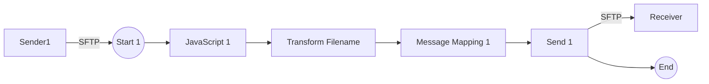

**iFlowId**: Connectivity_test_UK2_SFTP_copy - **iFlowVersion**: 1.0.1

**Mermaid Diagram**

**BPMN Diagram**

**Functional Summary**
- **Brief description of the iFlow**
This iFlow retrieves a file from an SFTP server, transforms the filename, performs message mapping, and then sends the file to another SFTP server.

- **Involved systems with Adapters Type and Endpoint Type**
    - Sender1: SFTP (EndpointSender)
    - Receiver: SFTP (EndpointRecevier)

- **Key steps**
 1. Start: Receive file from the initial SFTP sender.
 2. JavaScript 1: Executes a JavaScript script (no script code defined).
 3. Transform Filename: Executes a Groovy script named "transformFilename.groovy" to modify the filename.
 4. Message Mapping 1: Performs a message mapping.
 5. Send 1: Sends the file to the destination SFTP receiver.
 6. End: Completes the iFlow.

- **Message transformation**
    - Transform Filename: Uses Groovy script `transformFilename.groovy`.
    - Message Mapping 1: Message Mapping activity configured, but mapping name is not set (empty values for mappinguri and mappingname)

- **Externalized parameters list, configured values and their descriptions**
    - `host`: Configured value: `portaluk2.rg.repsol.com:22`. Description: SFTP server host and port for the destination SFTP receiver.
    - `user_uk2`: Configured value: ``. Description: Username for destination SFTP receiver.

- **DataStore / JMS Dependency**
Not Found

- **Cloud Connector Dependency**
Yes

- **Common Scripts Dependency**
Not Found

- **ProcessDirect ComponentType Dependency**
Not Found