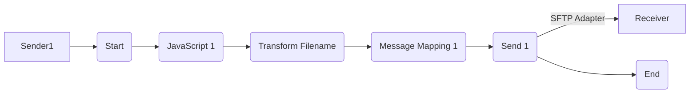

**iFlowId**: Connectivity_test_UK2_SFTP_copy - **iFlowVersion**: 1.0.1

**Mermaid Diagram**

**BPMN Diagram**

**Functional Summary**
- **Brief description of the iFlow**
This iFlow retrieves a file from a source SFTP server, transforms the filename, maps the message, and sends the file to a destination SFTP server.

- **Involved systems with Adapters Type and Endpoint Type**
    - Sender1: SFTP (Sender, EndpointSender)
    - Receiver: SFTP (Receiver, EndpointRecevier)

- **Key steps**
    1. Start: Receives file from source SFTP server.
    2. JavaScript 1:  JavaScript step with empty script.
    3. Transform Filename: Groovy script to transform the filename.
    4. Message Mapping 1: Message Mapping.
    5. Send 1: Sends the transformed file to the destination SFTP server.
    6. End: Completes the iFlow.

- **Message transformation**
    - Transform Filename: Groovy script "transformFilename.groovy" is used to modify the filename.
    - Message Mapping 1: Message Mapping activity without specified mapping.

- **Externalized parameters list, configured values and their descriptions**
    - host: portaluk2.rg.repsol.com:22 (No description available)
    - user_uk2: (No description available)

- **DataStore / JMS Dependency**
Not Found

- **Cloud Connector Dependency**
Yes

- **Common Scripts Dependency**
Not Found

- **ProcessDirect ComponentType Dependency**
Not Found