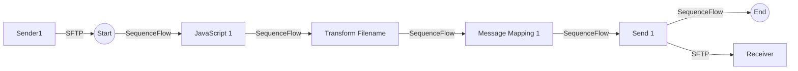

**iFlowId**: Connectivity_test_UK2_SFTP_copy - **iFlowVersion**: 1.0.1

**Mermaid Diagram**

**BPMN Diagram**

**Functional Summary**
-   **Brief description of the iFlow**
    This iFlow retrieves a file from an SFTP server and sends it to another SFTP server after some transformation steps.

-   **Involved systems with Adapters Type and Endpoint Type**
    -   Sender1 (SFTP, EndpointSender)
    -   Receiver (SFTP, EndpointRecevier)

-   **Key steps**
    1.  Receive file from SFTP server.
    2.  Execute a JavaScript.
    3.  Transform the filename using a Groovy Script.
    4.  Map the message content using a Message Mapping.
    5.  Send the file to another SFTP server.

-   **Message transformation**
    -   Transform Filename (Groovy Script)
    -   Message Mapping 1 (Message Mapping)

-   **Externalized parameters list, configured values and their descriptions**
    -   host: portaluk2.rg.repsol.com:22
    -   user_uk2: *(No description available)*

-   **DataStore / JMS Dependency**
    Not Found

-   **Cloud Connector Dependency**
    Yes

-   **Common Scripts Dependency**
    Not Found

-   **ProcessDirect ComponentType Dependency**
    Not Found