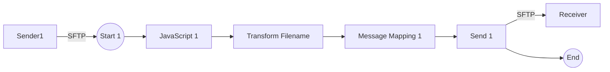

**iFlowId**: Connectivity_test_UK2_SFTP_copy - **iFlowVersion**: 1.0.1

**Mermaid Diagram**

**BPMN Diagram**

**Functional Summary**
- **Brief description of the iFlow**
This iFlow retrieves a file from an external SFTP server and sends it to another SFTP server. It involves a Groovy script to transform the filename, a JavaScript script, and a message mapping step.

- **Involved systems with Adapters Type and Endpoint Type**
    - Sender1: SFTP (EndpointSender)
    - Receiver: SFTP (EndpointRecevier)

- **Key steps**
 1. Receive message from SFTP sender.
 2. Execute JavaScript script.
 3. Transform filename using Groovy script.
 4. Perform Message Mapping.
 5. Send the message to the SFTP receiver.

- **Message transformation**
    - Transform Filename: Uses the `transformFilename.groovy` script.
    - Message Mapping 1: Uses a Message Mapping step

- **Externalized parameters list, configured values and their descriptions**
    - `host`: `portaluk2.rg.repsol.com:22` (SFTP host address for the receiver)
    - `user_uk2`: `` (Username for the SFTP server for the receiver)

- **DataStore / JMS Dependency**
Not Found

- **Cloud Connector Dependency**
Yes

- **Common Scripts Dependency**
Not Found

- **ProcessDirect ComponentType Dependency**
Not Found