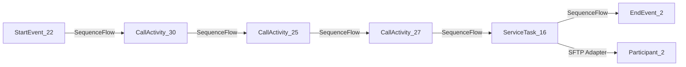

**iFlowId**: Connectivity_test_UK2_SFTP_copy - **iFlowVersion**: 1.0.1

**Mermaid Diagram**

**BPMN Diagram**

**Functional Summary**
- **Brief description of the iFlow**
This iFlow retrieves a file from a source SFTP server, transforms the filename, maps the message, and sends the file to a destination SFTP server.

- **Involved systems with Adapters Type and Endpoint Type**
    - Sender1: SFTP Adapter (EndpointSender)
    - Receiver: SFTP Adapter (EndpointRecevier)

- **Key steps**
    1.  Start: Receive file from source SFTP server.
    2.  JavaScript 1: Perform a javascript.
    3.  Transform Filename: Rename the file using a Groovy script.
    4.  Message Mapping 1: Maps the message to new format
    5.  Send 1: Send the file to the destination SFTP server.
    6.  End: iFlow execution completed.

- **Message transformation**
    - Transform Filename: Uses groovy script transformFilename.groovy to rename the incoming file.
    - Message Mapping 1: Maps the message to new format

- **Externalized parameters list, configured values and their descriptions**
    - host: portaluk2.rg.repsol.com:22 (SFTP server host and port)
    - user_uk2:  (Username for the destination SFTP server.)

- **DataStore / JMS Dependency**
Not Found

- **Cloud Connector Dependency**
Yes

- **Common Scripts Dependency**
Not Found

- **ProcessDirect ComponentType Dependency**
Not Found