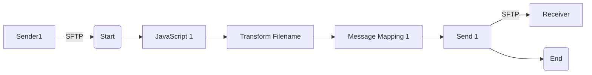

**iFlowId:** Connectivity_test_UK2_SFTP_copy - **iFlowVersion:** 1.0.1

**Mermaid Diagram**

**BPMN Diagram**

**Functional Summary**
- **Brief description of the iFlow**
This iFlow retrieves a file from an SFTP server and sends it to another SFTP server after some transformations.

- **Involved systems with Adapters Type and Endpoint Type**
    - Sender1: SFTP, EndpointSender
    - Receiver: SFTP, EndpointRecevier

- **Key steps**
    1. Start: The iFlow is triggered by a file arriving on the Sender SFTP server.
    2. JavaScript 1: Executes a javascript.
    3. Transform Filename: Executes a Groovy script to transform the filename.
    4. Message Mapping 1: Performs a message mapping.
    5. Send 1: Sends the transformed message to the Receiver SFTP server.
    6. End: The iFlow completes.

- **Message transformation**
    - Transform Filename: Groovy script `transformFilename.groovy` is used for filename transformation.
    - Message Mapping 1: Message mapping is performed

- **Externalized parameters list, configured values and their descriptions**
    - host: portaluk2.rg.repsol.com:22, SFTP server host and port for receiver.
    - user_uk2: , SFTP user for receiver.

- **DataStore / JMS Dependency**
Not Found

- **Cloud Connector Dependency**
Yes

- **Common Scripts Dependency**
Not Found

- **ProcessDirect ComponentType Dependency**
Not Found