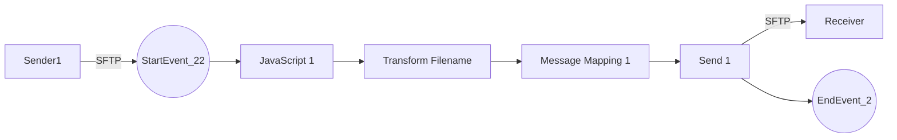

**iFlowId**: Connectivity_test_UK2_SFTP_copy - **iFlowVersion**: 1.0.1

**Mermaid Diagram**

**BPMN Diagram**

**Functional Summary**
- **Brief description of the iFlow**
This iFlow retrieves a file from an external SFTP server and sends it to another SFTP server after some transformation steps.

- **Involved systems with Adapters Type and Endpoint Type**
    - Sender1: SFTP Adapter (EndpointSender)
    - Receiver: SFTP Adapter (EndpointRecevier)

- **Key steps**
    1. Starts with a timer event, triggered every 10 seconds.
    2. Executes a JavaScript script.
    3. Executes a Groovy script called `transformFilename.groovy`.
    4. Performs a Message Mapping.
    5. Sends the file to the receiver SFTP server.

- **Message transformation**
    - A Groovy script named `transformFilename.groovy` is used.
    - A Message Mapping step is executed.

- **Externalized parameters list, configured values and their descriptions**
    - `host`: `portaluk2.rg.repsol.com:22` (SFTP host address for the Receiver)
    - `user_uk2`: `` (SFTP username for the Receiver)

- **DataStore / JMS Dependency**
Not Found

- **Cloud Connector Dependency**
Yes

- **Common Scripts Dependency**
Not Found

- **ProcessDirect ComponentType Dependency**
Not Found