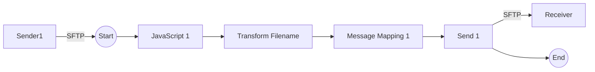

**iFlowId**: Connectivity_test_UK2_SFTP_copy - **iFlowVersion**: 1.0.1

**Mermaid Diagram**

**BPMN Diagram**

**Functional Summary**
- **Brief description of the iFlow**
This iFlow retrieves a file from an SFTP server and sends it to another SFTP server after performing filename transformation and message mapping.

- **Involved systems with Adapters Type and Endpoint Type**
    - Sender1 - SFTP - EndpointSender
    - Receiver - SFTP - EndpointRecevier

- **Key steps**
 1.  Start: The iFlow starts upon receiving a message from the source SFTP server.
 2.  JavaScript: Executes a JavaScript script (empty body).
 3.  Transform Filename: A Groovy script named `transformFilename.groovy` is executed to transform the filename.
 4.  Message Mapping: Message Mapping step to transform the message.
 5.  Send: Sends the message to the destination SFTP server.
 6.  End: The iFlow ends after successfully sending the message.

- **Message transformation**
    - Filename Transformation: Uses a Groovy script `transformFilename.groovy`.
    - Message Mapping: Uses a message mapping step but no mapping details are provided.

- **Externalized parameters list, configured values and their descriptions**
    - host: portaluk2.rg.repsol.com:22 (SFTP host address)
    - user_uk2: (SFTP username)

- **DataStore / JMS Dependency**
Not Found

- **Cloud Connector Dependency**
Yes (Proxy Type is sapcc in Receiver SFTP Adapter)

- **Common Scripts Dependency**
Not Found

- **ProcessDirect ComponentType Dependency**
Not Found