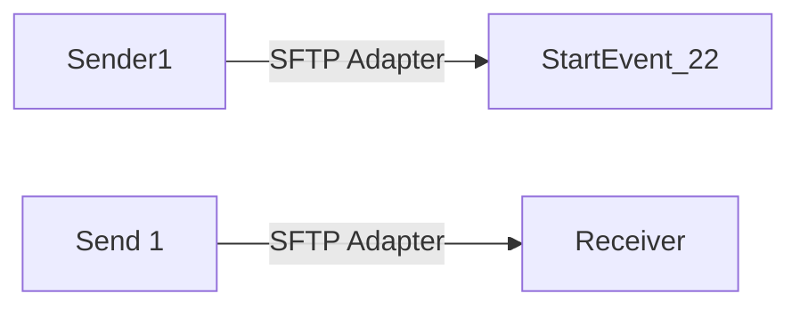

**iFlowId**: Connectivity_test_UK2_SFTP_copy - **iFlowVersion**: 1.0.1

**Mermaid Diagram**

**BPMN Diagram**

**Functional Summary**
- **Brief description of the iFlow**
This iFlow retrieves a file from an SFTP server, transforms the filename, maps a message and then sends it to another SFTP server.

- **Involved systems with Adapters Type and Endpoint Type**
  - Sender1 (SFTP, EndpointSender)
  - Receiver (SFTP, EndpointRecevier)

- **Key steps**
  1. Retrieve file from SFTP server using Sender1 adapter.
  2. Execute a JavaScript.
  3. Transform Filename via Groovy Script.
  4. Perform message mapping.
  5. Send the message to SFTP server using Receiver adapter.

- **Message transformation**
  - Transform Filename using `transformFilename.groovy` script.
  - Message Mapping (no specific mapping specified in the XML)

- **Externalized parameters list, configured values and their descriptions**
  - host: portaluk2.rg.repsol.com:22 (No description available)
  - user_uk2:  (No description available)

- **DataStore / JMS Dependency**
Not Found

- **Cloud Connector Dependency**
Yes

- **Common Scripts Dependency**
Not Found

- **ProcessDirect ComponentType Dependency**
Not Found