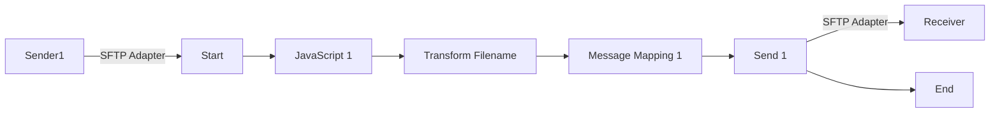

**iFlowId**: Connectivity_test_UK2_SFTP_copy - **iFlowVersion**: 1.0.1

**Mermaid Diagram**

**BPMN Diagram**

**Functional Summary**
- **Brief description of the iFlow**
This iFlow retrieves a file from an SFTP server, transforms the filename, maps the message, and sends the file to another SFTP server.

- **Involved systems with Adapters Type and Endpoint Type**
    - Sender1: SFTP Adapter, EndpointSender
    - Receiver: SFTP Adapter, EndpointRecevier

- **Key steps**
    1.  Receive file from Sender1 via SFTP.
    2.  Execute a JavaScript.
    3.  Transform Filename using Groovy Script.
    4.  Map the message using Message Mapping.
    5.  Send file to Receiver via SFTP.

- **Message transformation**
    - Transform Filename using Groovy Script (transformFilename.groovy).
    - Message Mapping (no mapping details provided).

- **Externalized parameters list, configured values and their descriptions**
    - host: portaluk2.rg.repsol.com:22 (SFTP server host and port for the receiver)
    - user_uk2:  (Username for the receiver SFTP server)

- **DataStore / JMS Dependency**
Not Found

- **Cloud Connector Dependency**
Yes

- **Common Scripts Dependency**
Not Found

- **ProcessDirect ComponentType Dependency**
Not Found