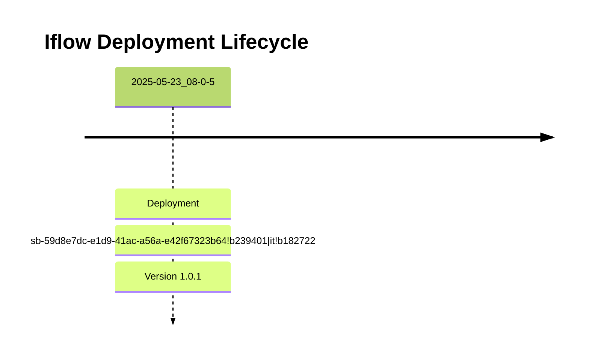

# Integration Flow: Connectivity_test_UK2_SFTP_copy

This document provides an overview, deployment history, and links to specific versions for the integration flow `Connectivity_test_UK2_SFTP_copy`.

## Deployment History
<!-- DEPLOYMENT_TIMELINE_START -->

<!-- DEPLOYMENT_TIMELINE_END -->

## Available Versions
<!-- VERSION_LINKS_START -->
- [Version 1.0.1 (Deployed: 2025-05-23 08:00:05 CEST CEST)](./1.0.1/readme.md)
<!-- VERSION_LINKS_END -->