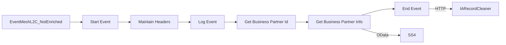

**iFlowId**: S4_BusinessPartners_-_Event_Delivery - **iFlowVersion**: 1.0.0

**Mermaid Diagram**

**Functional Summary**
- **Brief description of the iFlow**
This iFlow receives Business Partner events from Event Mesh, retrieves additional information from S/4HANA, and then sends the enriched data to IARecordCleaner.

- **Involved systems with Adapters Type and Endpoint Type**
    - EventMeshL2C_NotEnriched: AMQP Adapter, EndpointSender
    - SS4: OData V2 Adapter, EndpointRecevier
    - IARecordCleaner: HTTP Adapter, EndpointRecevier

- **Key steps**
    1. Receives Business Partner event via AMQP from Event Mesh.
    2. Sets headers (Content-Type, Accept, APIKey) and properties (TOPIC, SAP_ODataV2_RefreshCacheOnExpiry).
    3. Logs the Camel Context.
    4. Extracts the Business Partner ID using a Groovy script.
    5. Retrieves Business Partner information from S/4HANA using the OData V2 adapter.
    6. Sends the enriched Business Partner data to the IARecordCleaner via HTTP.

- **Message transformation**
    - Groovy script "GetBusinessPartnerId.groovy" extracts the BusinessPartnerId from the incoming message.
    - OData adapter transforms the request for retriving business partner information.
    - The Enricher step sets header and property values.

- **Externalized parameters list and their descriptions**
    - SS4_BASIC_AUTH_ENTRY: Credential name for Basic Authentication to SS4.
    - LocationID: Location ID for the OData receiver.
    - API_MANAGER_ENDPOINT: API endpoint for the OData receiver.
    - IA_ADDRESS: HTTP endpoint address for IARecordCleaner.
    - PRODUCTS_API_APIKEY: API key for the Products API.

- **DataStore / JMS Dependency**
Not Found

- **Cloud Connector Dependency**
Yes

- **Common Scripts Dependency**
List of scripts: Log_Camel_Context.groovy, GetBusinessPartnerId.groovy

- **ProcessDirect ComponentType Dependency**
Not Found