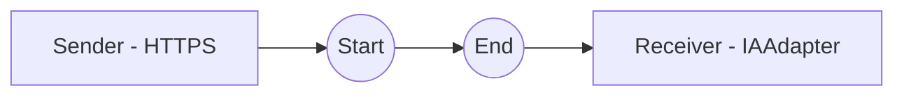

**iFlowId**: Testing_Endpoint - **iFlowVersion**: 1.0.0

**Mermaid Diagram**

**Functional Summary**
**Brief description of the iFlow**
This iFlow receives a request via HTTPS, passes the message to an IAAdapter (AzureOpenAI), and then sends the message to a receiver.

**Involved systems with Adapters Type and Endpoint Type**
- Sender: HTTPS (HTTPS)
- Receiver: IAAdapter (com-avvale, AzureOpenAI endpoint: https://aiobs-oai-int-fc.openai.azure.com/)

**Key steps**
1. Receive message via HTTPS endpoint.
2. Send message to IAAdapter.
3. Message is delivered to receiver.

**Message transformation**
No explicit message transformation steps are defined in the provided XML.

**Externalized parameters list and their descriptions**
No externalized parameters are explicitly defined in the provided XML.

**DataStore / JMS Dependency**
Not Found

**Cloud Connector Dependency**
Not Found

**Common Scripts Dependency**
Not Found

**ProcessDirect ComponentType Dependency**
Not Found