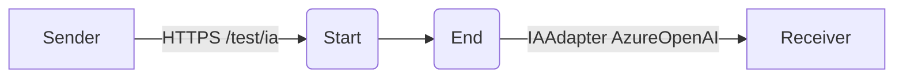

**iFlowId**: Testing_Endpoint - **iFlowVersion**: 1.0.0

**Mermaid Diagram**

**Functional Summary**
**Brief description of the iFlow**
This iFlow receives a message via HTTPS, then sends the message to an IAAdapter which uses AzureOpenAI.

**Involved systems with Adapters Type and Endpoint Type**
- Sender: HTTPS Adapter, Endpoint Type: N/A
- Receiver: IAAdapter, Endpoint Type: https://aiobs-oai-int-fc.openai.azure.com/

**Key steps**
1.  Receive message via HTTPS endpoint.
2.  Send message to the IAAdapter.
3.  IAAdapter process the message using AzureOpenAI and sends response to Receiver.

**Message transformation**
- No explicit message transformation step is defined in the iFlow.

**Externalized parameters list and their descriptions**
- urlPath: `/test/ia` (HTTPS Adapter). Specifies the URL path for the HTTPS endpoint.
- maximumBodySize: `40` (HTTPS Adapter). Specifies the maximum body size allowed for the HTTPS request.
- ClientKey: `b43cf1d6514c4d81a071274bf2237e42` (IAAdapter)
- ChatModelID: `gpt35turbo` (IAAdapter)
- ClientEndpoint: `https://aiobs-oai-int-fc.openai.azure.com/` (IAAdapter)
- IAType: `AzureOpenAI` (IAAdapter)

**DataStore / JMS Dependency**
Not Found

**Cloud Connector Dependency**
Not Found

**Common Scripts Dependency**
Not Found

**ProcessDirect ComponentType Dependency**
Not Found