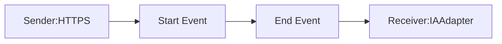

**iFlowId:** Testing_Endpoint - **iFlowVersion:** 1.0.0

**Mermaid Diagram**

**Functional Summary**
**Brief description of the iFlow**
This iFlow receives a message via HTTPS, then sends the message to an IAAdapter (Avvale). The iFlow exposes a endpoint for recieving messages via HTTPS adapter and then invokes the IAAdpter to send the data to AzureOpenAI.

**Involved systems with Adapters Type and Endpoint Type**
- Sender: HTTPS (Sender) - /test/ia
- Receiver: IAAdapter (Receiver) - https://aiobs-oai-int-fc.openai.azure.com/

**Key steps**
1. Receive message via HTTPS at endpoint `/test/ia`.
2. Send message to the IAAdapter.
3. The IAAdapter will invoke the AzureOpenAI endpoint.

**Message transformation**
None.

**Externalized parameters list and their descriptions**
- ClientKey: b43cf1d6514c4d81a071274bf2237e42 (Key for IAAdapter)
- ChatModelID: gpt35turbo (Chat Model ID for IAAdapter)
- urlPath: /test/ia (URL Path for HTTPS endpoint)
- maximumBodySize: 40 (Maximum body size for HTTPS endpoint)
- xsrfProtection: 0 (XSRF protection for HTTPS endpoint)
- userRole: ESBMessaging.send (User role for HTTPS endpoint)
- senderAuthType: RoleBased (Sender authentication type for HTTPS endpoint)

**DataStore / JMS Dependency**
Not Found

**Cloud Connector Dependency**
Not Found

**Common Scripts Dependency**
Not Found

**ProcessDirect ComponentType Dependency**
Not Found