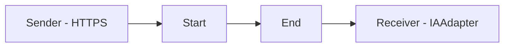

**iFlowId**: Testing_Endpoint - **iFlowVersion**: 1.0.0

**Mermaid Diagram**

**Functional Summary**
**Brief description of the iFlow**
This iFlow receives data via HTTPS, passes it through an integration process, and sends it to an Azure OpenAI endpoint using an IAAdapter.

**Involved systems with Adapters Type and Endpoint Type**
- Sender: HTTPS (Endpoint Type: Not specified)
- Receiver: IAAdapter (Endpoint Type: https://aiobs-oai-int-fc.openai.azure.com/)

**Key steps**
1. Receive message via HTTPS.
2. Process message through the integration process.
3. Send message to the Azure OpenAI endpoint via the IAAdapter.

**Message transformation**
No explicit message transformation steps are defined within the provided XML.

**Externalized parameters list and their descriptions**
No externalized parameters are defined in the provided XML.

**DataStore / JMS Dependency**
Not Found

**Cloud Connector Dependency**
Not Found

**Common Scripts Dependency**
Not Found

**ProcessDirect ComponentType Dependency**
Not Found