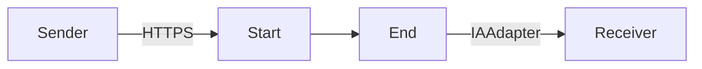

**iFlowId**: Testing_Endpoint - **iFlowVersion**: 1.0.0

**Mermaid Diagram**

**BPMN Diagram**

**Functional Summary**
- **Brief description of the iFlow**
  This iFlow receives an HTTPS request, passes it through an integration process, and sends the result to an Azure OpenAI endpoint via the IAAdapter.

- **Involved systems with Adapters Type and Endpoint Type**
  - Sender: HTTPS (EndpointSender)
  - Receiver: IAAdapter (EndpointRecevier), AzureOpenAI

- **Key steps**
  1. Receive HTTPS request at `/test/ia`.
  2. Process the message within the integration process.
  3. Send the message to Azure OpenAI.

- **Message transformation**
  No explicit message transformation steps are defined in the provided XML.

- **Externalized parameters list, configured values and their descriptions**
  No externalized parameters are defined in the provided `parameters.prop` file.

- **DataStore / JMS Dependency**
  Not Found

- **Cloud Connector Dependency**
  Not Found

- **Common Scripts Dependency**
  Not Found

- **ProcessDirect ComponentType Dependency**
  Not Found