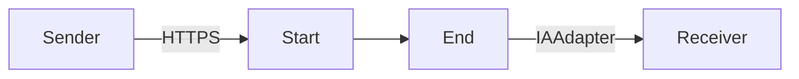
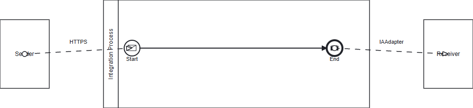

**iFlowId**: Testing_Endpoint - **iFlowVersion**: 1.0.0

**Mermaid Diagram**

**BPMN Diagram**

**Functional Summary**
- **Brief description of the iFlow**
This iFlow receives a message via HTTPS, passes it through an integration process, and then sends it to a receiver using the IAAdapter.

- **Involved systems with Adapters Type and Endpoint Type**
    - Sender: HTTPS (EndpointSender)
    - Receiver: IAAdapter (EndpointRecevier)

- **Key steps**
    1. Receive message via HTTPS.
    2. Process message in the Integration Process.
    3. Send message via IAAdapter to the receiver.

- **Message transformation**
    No specific message transformation steps are defined in the provided BPMN XML.

- **Externalized parameters list, configured values and their descriptions**
    No externalized parameters found in the `parameters.prop` file.

- **DataStore / JMS Dependency**
    Not Found

- **Cloud Connector Dependency**
    Not Found

- **Common Scripts Dependency**
    Not Found

- **ProcessDirect ComponentType Dependency**
    Not Found