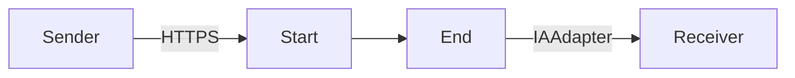

**iFlowId**: Testing_Endpoint - **iFlowVersion**: 1.0.0

**Mermaid Diagram**

**BPMN Diagram**

**Functional Summary**
-   **Brief description of the iFlow**
    This iFlow receives a message via HTTPS, passes it through an integration process, and then sends it to a receiver system using the IAAdapter (AzureOpenAI).

-   **Involved systems with Adapters Type and Endpoint Type**
    -   Sender: HTTPS (EndpointSender)
        -   Adapter Type: HTTPS
        -   Endpoint Type: N/A
    -   Receiver: IAAdapter (EndpointRecevier)
        -   Adapter Type: IAAdapter
        -   Endpoint Type: https://aiobs-oai-int-fc.openai.azure.com/

-   **Key steps**
    1.  Receive message via HTTPS at `/test/ia` endpoint.
    2.  Process the message within the Integration Process.
    3.  Send the message to the receiver system via IAAdapter.

-   **Message transformation**
    No explicit message transformation step is defined in the provided BPMN XML.

-   **Externalized parameters list, configured values and their descriptions**
    No externalized parameters are defined in the `parameters.prop` file.

-   **DataStore / JMS Dependency**
    Not Found

-   **Cloud Connector Dependency**
    Not Found

-   **Common Scripts Dependency**
    Not Found

-   **ProcessDirect ComponentType Dependency**
    Not Found