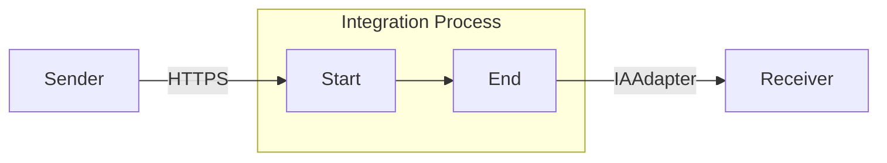

**iFlowId**: Testing_Endpoint - **iFlowVersion**: 1.0.0

**Mermaid Diagram**

**BPMN Diagram**

**Functional Summary**
- **Brief description of the iFlow**:
  This iFlow receives a message via HTTPS, then sends it to an IAAdapter endpoint.

- **Involved systems with Adapters Type and Endpoint Type**:
  - Sender: HTTPS (EndpointSender)
  - Receiver: IAAdapter (EndpointRecevier)

- **Key steps**:
  1. Receive message via HTTPS.
  2. Send message to IAAdapter.

- **Message transformation**:
  No message transformation steps are explicitly defined in the provided XML.

- **Externalized parameters list, configured values and their descriptions**:
  No externalized parameters are defined in the provided parameters.prop file.

- **DataStore / JMS Dependency**:
  Not Found

- **Cloud Connector Dependency**:
  Not Found

- **Common Scripts Dependency**:
  Not Found

- **ProcessDirect ComponentType Dependency**:
  Not Found