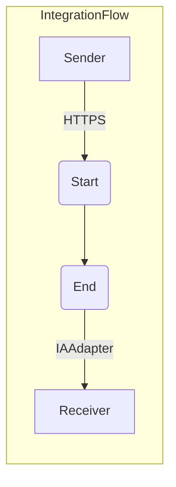

**iFlowId**: Testing_Endpoint - **iFlowVersion**: 1.0.0

**Mermaid Diagram**

**BPMN Diagram**

**Functional Summary**
- **Brief description of the iFlow**
  This iFlow receives an HTTPS request, processes it, and sends the result to an IAAdapter.

- **Involved systems with Adapters Type and Endpoint Type**
  - Sender: HTTPS (EndpointSender)
  - Receiver: IAAdapter (EndpointRecevier), Endpoint: `https://aiobs-oai-int-fc.openai.azure.com/`

- **Key steps**
  1. Receive HTTPS request.
  2. Process the message within the Integration Process (Start to End).
  3. Send message to IAAdapter.

- **Message transformation**
  No specific message transformation steps are defined in the provided BPMN. It's a direct flow from start to end.

- **Externalized parameters list, configured values and their descriptions**
  No externalized parameters were found in the `parameters.prop` file.

- **DataStore / JMS Dependency**
  Not Found

- **Cloud Connector Dependency**
  Not Found

- **Common Scripts Dependency**
  Not Found

- **ProcessDirect ComponentType Dependency**
  Not Found