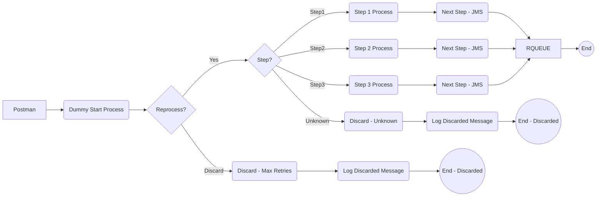

**iFlowId**: SEDA_Model_-_Single_Queue_-_Restart_and_Discard - **iFlowVersion**: 1.0.0

**Functional Summary**

- **Brief description of the iFlow**
This iFlow implements a SEDA (Staged Event-Driven Architecture) pattern using JMS queues. It receives messages, processes them in a sequence of steps (Step1, Step2, Step3), and sends them to a receiver. The flow includes exception handling at each step, logging exceptions, and discarding messages exceeding a retry threshold or with unknown processing steps.

- **Involved systems**
    - SQUEUE (Sender Queue)
    - RQUEUE (Receiver Queue)
    - Postman (Used as an external trigger via HTTPS)

- **Used Adapters**
    - JMS (for sending and receiving messages)
    - HTTPS (for receiving initial requests from Postman)

- **Key steps**
    1. Receive message via JMS from SQUEUE. Triggered by HTTPS request from Postman to Dummy Start.
    2. Check number of re-processing attempts in the queue (SAPJMSRetries)
    3. Based on value of parameter 'Step' process the message.
    4. Execute 'Step 1': Prepare the message, call a subprocess for execution and enrich content.
    5. Send message to RQUEUE or continue to other processing step in the router based on the value of 'Step' parameter.
    6. Execute 'Step 2': Prepare the message, call a subprocess for execution and enrich content.
    7. Execute 'Step 3': Test throwing exception. If exception occurs, run exception sub-process. 
    8. Send message to RQUEUE.
    9. If a step cannot be determined or max retries are exceeded, discard the message and log the event.

- **Message transformation**
    -  Header manipulation (setting sender, receiver, and message type) is performed using the "Enricher" component.
    -  Property creation and deletion is performed using the "Enricher" component.
    -  Prepare step 2, prepare step 3 transforms messages.

- **Externalized parameters list and their descriptions**
    - `SEDA_MAIN_QUEUE`: Specifies the JMS queue used for message exchange.
    - `Retention Threshold 4 Alerting`: Configures the retention threshold for alerting purposes (related to JMS).
    - `Expiration Period`: Defines the expiration period for messages (related to JMS).
    - `Number of Concurrent Processes`: Specifies the number of concurrent processes for JMS receiver.
    - `Maximum Retry Interval`: Sets the maximum retry interval for JMS.
    - `Retry Interval`: Configures the retry interval for JMS.
    - `MaxRetries`: Configures the maximum retries for JMS.

- **DataStore / JMS Dependency**
Yes

**Mermaid Diagram**

